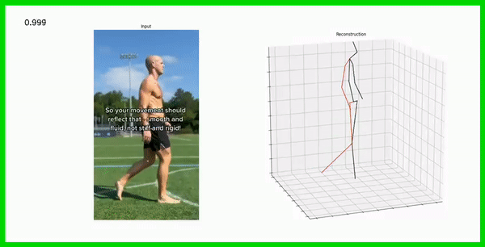
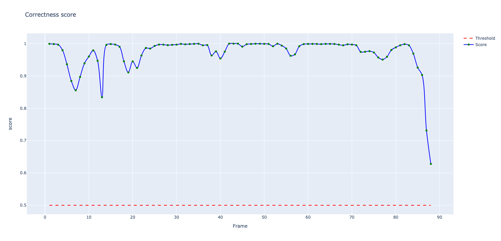

*Context: this project was done as part of the Deep Learning and CNNs course at University of Technology Sydney, with 2 other students. More details can be found [here](https://github.com/joanvelja/WrongPose-42028).*

Bad postures in a work environment can lead to various health issues and discomfort for employees. Some potential issues associated with bad postures include:

- **Musculoskeletal Disorders (MSDs)**: Prolonged poor posture can contribute to the development of MSDs such as back pain, neck pain, shoulder pain, and repetitive strain injuries.
- **Fatigue and Reduced Productivity**: Maintaining uncomfortable postures for extended periods can lead to muscle fatigue, decreased energy levels, and reduced overall productivity.
- **Increased Risk of Injury**: Poor postures can increase the risk of acute injuries, such as strains, sprains, and falls, as the body’s balance and stability are compromised.
- **Joint and Nerve Compression**: Incorrect postures can cause compression on joints, nerves, and blood vessels, leading to conditions like carpal tunnel syndrome, thoracic outlet syndrome, and sciatica.
- **Reduced Respiratory Function**: Certain postures, especially those that involve slouching or hunching over, can restrict proper lung expansion, leading to shallow breathing and decreased oxygen intake.

What we suggest for this application is a web-based service which allows the user to upload media files (videos or images) and obtain as an output the pose estimation through the rendering of a stick figure, along with a measure we engineered, called goodness of pose. This metric basically provides a score of how good a pose is, given a previous detection of the activity being carried out (i.e., standing, sitting, lifting weights, and so on).

Our models take an input video and extract 17 body keypoints, enabling a detailed assessment of body posture. By computing 8 sensitive angles, we can accurately evaluate the correctness of the pose in each frame. Our system is designed for efficiency, providing high-performance evaluation at a rate of 2 frames per second. We prioritize accuracy to ensure reliable results for every frame of the input video.

Our web application utilizes the power of Detectron2, a Convolutional Neural Network (CNN) based on a ResNetXt101 Faster RCNN architecture. Detectron2 carries out person detection and 2D keypoints coordinates regression, enabling precise localization of body parts. Following the 2D keypoint extraction, we employ VideoPose3D, a specialized CNN with 243 symmetrical strided convolutions. This model enhances the understanding of human body movements and helps us provide a comprehensive evaluation of posture.

To quantify the quality of the assessed posture, we employ a Score Regressor, which is an MLP. The regressor consists of two hidden layers with 64 and 32 nodes, respectively, and a sigmoid output. With a remarkable 98% test accuracy, the regressor provides reliable and meaningful scores. Our scoring system utilizes scale invariant features, ensuring accurate and consistent results regardless of the camera's position or the object's orientation in the detected scene. This means that our model can effectively evaluate postures regardless of where the camera is placed or how the detected object is positioned. By leveraging these advanced features, our scoring mechanism provides reliable and meaningful assessments of posture correctness.

Sample output (frame-wise pose estimation and goodness of pose score) is shown below:

